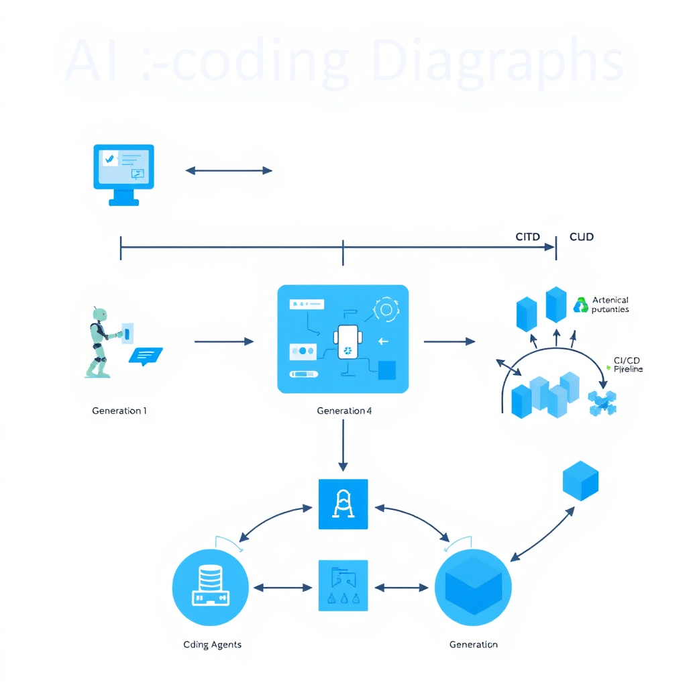

> ⚠️ **AI Disclaimer & Warning:**
> This report was autonomously generated by an AI research assistant. AI models can make mistakes, hallucinate details, or generate inaccurate, outdated, or unnecessary content. Please independently verify critical facts, citations, and technical claims before relying on this document.

---

# Agentic AI and the Future of Software Development (2024‑2030)

## Executive Summary
Agentic AI—autonomous software agents that can plan, code, test, and deploy—is moving from experimental prototypes to production‑grade tooling. Three generations can be distinguished:

| Generation | Core Architecture | Typical Example | Primary Strength |
|------------|-------------------|----------------|------------------|
| **1. Single‑Agent / Chat** | Monolithic LLM with a single context window | GitHub Copilot, Amazon CodeWhisperer | Easy to integrate, low coordination overhead |
| **2. Multi‑Agent Frameworks** | Distributed specialists (Planner, Coder, Tester) that exchange messages | AutoGPT, BabyAGI, Microsoft Agentic DevOps pilot | Modularity, better handling of complex tasks |
| **3. Autonomous Tool‑Use** | Agents with long‑term memory, tool‑chaining, and self‑correction | LangChain‑based CI/CD agents, IBM Watson Orchestrate pilot | End‑to‑end automation, ability to interact with cloud APIs and internal services |

*The transition from monolithic chat-based assistants to autonomous, multi-agent tool-use systems.*

By 2030 the software‑development lifecycle (SDLC) will be reshaped: routine implementation, testing, and deployment become highly automated, while requirements engineering, high‑level architecture, and ethical governance remain human‑centric. The most promising path to reliable autonomous development is a **Hybrid Autonomous Tool‑Use architecture** that couples Generation‑3 agents with dynamic Human‑in‑the‑Loop (HITL) gating based on confidence scores.

---

## 1. Introduction
Software underpins every modern industry, yet the traditional development process is labor‑intensive, error‑prone, and costly. Recent advances in large language models (LLMs) have produced **coding assistants** that can generate syntactically correct code from natural‑language prompts. The next frontier is **Agentic AI**, where an LLM is not merely a static autocomplete but an *agent* capable of reasoning, planning, invoking external tools, and persisting state across sessions.

## 2. Core Concepts

## 3. Detailed Analysis

### 3.1 Generation 1 – Single‑Agent / Chat Coders

### 3.2 Generation 2 – Multi‑Agent Frameworks

### 3.3 Generation 3 – Autonomous Tool‑Use Agents

> **Image generation failed**
>
> The self-correction cycle of a Gen-3 autonomous agent involving tool invocation, verification, and memory updates.
>
> Error: Client error '402 Payment Required' for url 'https://router.huggingface.co/nscale/v1/images/generations' (Request ID: Root=1-6a9bff4b-6b55b9b61e2944546af78676;37e367ae-edd7-47ae-aa2c-2c09fc9d1cac)
For more information check: https://developer.mozilla.org/en-US/docs/Web/HTTP/Status/402

You have depleted your monthly included credits. Purchase pre-paid credits to continue using Inference Providers. Alternatively, subscribe to PRO to get 20x more included usage.

### 3.4 Human‑in‑the‑Loop (HITL) vs. Full Autonomy

---

## 4. Technical Workflow / Architecture for an Autonomous Development Pipeline

> **Image generation failed**
>
> Proposed architecture for an autonomous development pipeline with integrated Human-in-the-Loop gating.
>
> Error: Client error '402 Payment Required' for url 'https://router.huggingface.co/nscale/v1/images/generations' (Request ID: Root=1-6a9bff4b-7b25fc966ea8abe62e7dfefe;d93f56d2-caa3-4e5b-9d50-b9788f763502)
For more information check: https://developer.mozilla.org/en-US/docs/Web/HTTP/Status/402

You have depleted your monthly included credits. Purchase pre-paid credits to continue using Inference Providers. Alternatively, subscribe to PRO to get 20x more included usage.

A typical Generation‑3 pipeline for a new micro‑service might follow these steps:

1. **Requirement Capture**  
   - *Input*: Natural‑language feature description entered into a ticketing system (e.g., Jira).  
   - *Agent*: **Planner** parses the description, extracts functional specs, and creates a high‑level design diagram stored in a vector DB.

2. **Architecture Draft**  
   - Planner queries a **knowledge base** (e.g., internal design patterns) and proposes a component layout (REST API, DB schema).  
   - Output is persisted as a **design artifact** (YAML) and a confidence score is.